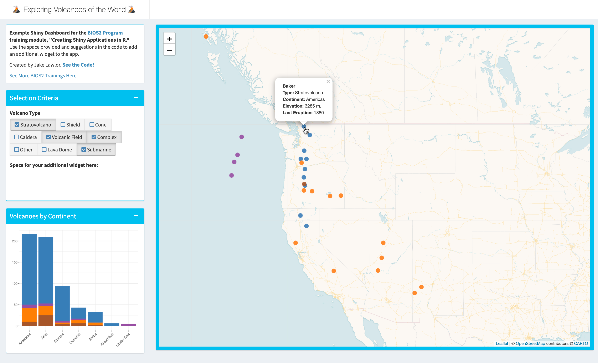

# Volcano Shiny App
Practice Shiny Dashboard for the BIOS2 Training Module, "Creating Shiny Applications in R"

Here, you will find code to create a Shiny Application to map volcanoes of the world. Use the code layout provided and suggestions in the code to add your own widget and further refine the volcano map.

## [Run the App!](https://jakelawlor.shinyapps.io/Volcanoes_of_the_World/)

